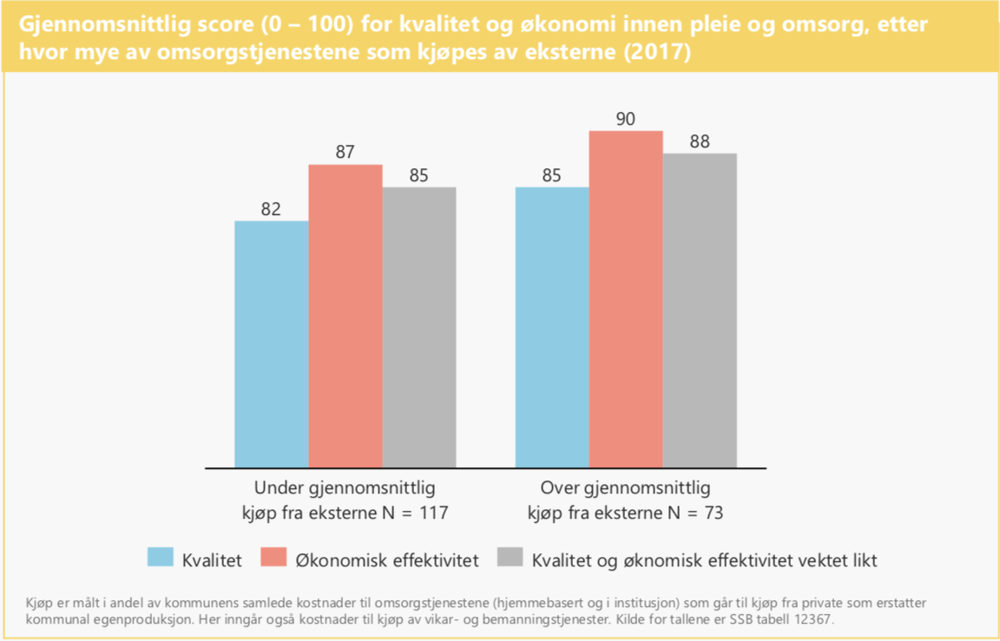

```{r setup, include=FALSE}
knitr::opts_chunk$set(echo = FALSE)

library(readxl)
library(tidyverse)
library(ggpubr)

#Importerer bakgrunnstallene fra NHOanalysen og tall på privatisering fra SSB 12367
dea <- read_excel("/Users/thomastallaksen/Documents/R/Prosjekter/Kvalitet19/190830_dea-analyse-resultat-og-input.xlsx")%>%
  mutate(Kommunenr = str_pad(Kommunenr, width=4, side="left", pad="0"))
ssb <- read_excel("/Users/thomastallaksen/Documents/R/Prosjekter/Kvalitet19/KOSbelop0000.xlsx")

# Endrer beløpene i SSB-tallene til numeric
ssb$Beløp <- as.numeric(ssb$Beløp)


```

\  

>>> *Problemet til Gabrielsen er imidlertid at Fafo ikke har analysert hvordan norske kommuner drifter tjenester og i hvilken grad de samarbeider med private. [...] Det er det vår undersøkelse Kvalitet19 gjør.*  
*Selv om også kommuner som driver tjenester i egenregi gjør det bra, viser resultatene at blant de kommunene som gjør det best, så er det overvekt av kommuner som samarbeider med private. Tallgrunnlaget, fra Helse Norge og Kostra, er tilgjengelig for Gabrielsen, LO eller for den saks skyld Fafo, dersom de ønsker å ettergå funn og de konklusjoner vi trekker.*

>>> **Anne Cecilie Kaltenborn**  
Administrerende direktør i NHO Service og Handel  
Dagens Næringsliv, 23.08.19

\  

## Formål

I dette notatet gjør jeg nettopp det Anne Cecilie Kalternborn oppfordrer til i leserinnlegget over. Jeg gjennomgår tallgrunnlaget og metoden NHO Service og Handel (heretter NHO-SH) benytter i rapportene i Kvalitet 19. NHO-SH har utarbeidet rapporter for en lang rekke kommuner, og hevder å kunne vise at det er en sammenheng mellom kvalitet og andelen av utgiftene i helse- og omsorgstjenestene som brukes på kjøp av eksterne tjenester. Jeg sjekker hva som inngår i tallene deres og om det er noen signifikant korrelasjon mellom kvalitetsindikatoren NHO-SH bruker og andelen av utgiftene som går til kjøp fra private. **Ved nærmere ettersyn viser både kvalitetsbegrepet deres å være tynt, og sammenhengen de hevder å ha funnet er ikke-eksisterende.**

NHO-SH har også sett på kostnadseffektiviteten i kommunene for Helse og omsorsgtjenester og renovasjon og renhold. Jeg har ikke gått nærmere inn på disse tallene, siden det er beregningene av kvalitet NHO-SH selv har lagt vekt på i fremstillingen av konklusjonene. 

## 1. Måler egentlig rapportene deres kvalitet?

Kvalitet er et stort og vidt begrep det er mulig å putte mye inn i, og det er veldig mye man kan få til å henge sammen med kvalitet nettopp fordi det kan operasjonaliseres på så mange ulike måter. NHO-SH sier de har benyttet seg av kvalitetsindikatorene som kommunene må rapportere til Helse Norge. De tre de oppgir at inngår i scoren deres er:

1. Antall sykehjemsbeboere og hjemmesykepleiere med kartlagt ernæringsstatus.
2. Antall sykehjemsbeboere uten helsetjenesteasossiert infeksjoner.
3. Antall hjemmeboende med kognitiv svikt med tilbud om dagaktivitetstilbud.

Hvor mange sykehjemsbeboere som har fått kartlagt ernæringsstatus og antall hjemmeboende demente med tilbud om dagaktivitetstilbud er rene kvantitative mål som ikke måler kvaliteten på tilbudet, bare at de har fått et tilbud. Da er antall med helsetjenesteasossierte infeksjoner antakelig et bedre mål. Som et generelt mål på kvaliteten i helse- og omsorgstjenestene i den enkelte kommunen er imidlertid ikke disse tre indikatorene tilstrekkelige. 

Det kan diskuteres om det i det hele tatt lar seg gjøre å måle kvalitet på en fornuftig måte ved hjelp av slike indikatorer, men som et minimum må indikatorene måle de faktiske resultatene av aktivitetene og ikke bare telle dem, og det må være et bredere spekter av arbeidsoppgavene i helse og omsorgs som faktisk måles.


## 2. Er sammenhengen mellom privatisering og kvalitetsmålene deres i det hele tatt signifikant?

Det er altså gode grunner til å ta kvalitetsscoren NHO-SH har utarbeidet med en stor klype salt. Men om vi for argumentets skyld lar det ligge, er det faktisk enda større problemer med hvordan NHO-SH hevder å kunne vise at det er en sammenheng mellom kvalitetsscoren til den enkelte kommunen og hvorvidt kommunen kjøper eksterne tjenester.

Måten de bruker for å vise denne sammenhengen er ved å sammenlikne kommuner som kjøper en større andel av tjenestene sine enn snittet, med kommuner som kjøper en mindre andel av tjenestene enn snittet. Her finner de at gruppen som kjøper flere tjenester enn snittet har tre prosentpoengs høyere gjennomsnittlig kvalitetscore enn de som kjøper mindre enn snittet.

{ width=70% }

Dette er en veldig grov inndeling for å skulle vise en slik sammenheng, og NHO-SH oppgir ingen steder hvorvidt denne forskjellen på 3 prosentpoeng mellom de to gruppene faktisk er signifikant. Det skal vi derfor teste. 


### Signifikanstest

For å teste hvorvidt sammenhengen er signifikant måtte vi først reprodusere tallene til NHO, noe som viste seg å være vanskeligere enn først antatt. For det første fikk vi opplyst, etter å ha henvendt oss til NHO Service og Handel direkte, at tall for kjøp fra andre kommuner også inngår i tallene for kjøp. Det utgjør ikke de helt store summene, men når Kaltenborn bruker tallene for å argumentere for effekten av å kjøpe flere tjenester av private er det merkelig å også inkludere kjøp fra kommuner. Det var også oppgitt at antall kommuner som ligger bak beregningen av gjennomsnittlig andel eksterne kjøp var 190, men i tallene NHO selv hadde oppgitt var det kun kvalitetsscore for 178 kommuner. Etter å ha kontaktet NHO-SH rettet de opp i denne feilen og publiserte kvalitetsscoren for de resterende 12 kommunene. 

Dersom vi ser på den den bivariate sammenhengen mellom andelen eksterne kjøp og kvalitetsscoren den enkelte kommunen får, er det ingen sammenheng å spore (se graf under). Sammenhengen mellom de to variablene er ikke signifikant. Med en enkel regresjonsanalyse (OLS) får vi et stigningstall (R) på 0,095, og en signifikansverdi på 0,19 (p). Det vil si at en kommune som har  kjøpt 10 prosentpoeng mer eksterne tjenester har en kvalitetsscore som er 0,95 poeng høyere, men at dette er feil i en av fem tilfeller. **Stigningstallet er så lav og signifikansverdien så høy at det rett og slett ikke er noen sammenheng å spore i tallene.** I samfunnsvitenskap pleier man å operere med at signifikansverdien p maksimalt kan være 0,05, mens det her altså er 0,19, skyhøyt over hva som kan regnes som en faktisk sammenheng. 

```{r corr, warning = FALSE, fig.height = 3.5, fig.width = 4, fig.align = "center"}

samlet <- ssb%>%
  filter(Artikkelnummer %in% c("AG2", "A370", "AGD4", "A590"))%>% #Filtrerer til kun de relevante artiklene
  filter(Funksjon != "Institusjonslokaler" | Artikkelnummer != "A370")%>% #Fjerner kjøp på A370 og institusjonslokaler
  group_by(Kommunenummer, Kommune, Funksjon, Artikkelnummer, Artikkel)%>%
  summarise(Kostnad = sum(Beløp, na.rm = TRUE))%>%  
  ungroup()%>%   
  mutate(Deler = ifelse(Artikkelnummer %in% c("A370", "AG2"), "Kjøp", "Kostnader"))%>%
  mutate(Kostnad = ifelse(Artikkelnummer == "A590", -Kostnad, Kostnad))%>%
  group_by(Kommunenummer, Kommune, Deler)%>%
  summarise(Kostnad = sum(Kostnad))%>% # Summerer kostnadene minus avskrivningene og kjøpene
  mutate(Andel = round(Kostnad/sum(Kostnad)*100, digits = 1))%>%
  filter(Deler == "Kjøp")

sammenkoblet <- dea%>%
  select(Kommunenr, `Kommune fullt navn`, `Score, kvalitet`)%>%
  left_join(samlet, by = c("Kommunenr" = "Kommunenummer"))%>%
  mutate(Snitt = ifelse(Andel > 6.5, "Over", "Under"))%>%
  na.omit()%>%
  group_by(Snitt)%>%
  summarise("Antall kommuner" = n(), Snittkvalitet = round(mean(`Score, kvalitet`), digits = 2), Standardavvik = sd(`Score, kvalitet`))

graf <- dea%>%
  select(Kommunenr, `Kommune fullt navn`, `Score, kvalitet`)%>%
  left_join(samlet, by = c("Kommunenr" = "Kommunenummer"))

ggplot(graf, aes(y = `Score, kvalitet`, x = Andel))+
  geom_point()+
  xlim(0,40)+
  xlab("Andel eksterne kjøp")+
  geom_smooth(method='lm')+
  stat_cor(method = "pearson", label.x = 20, label.y = 30)


```

Om vi deler gruppene inn på måten NHO-SH selv har gjort det, med en gruppe bestående av de kommunene som kjøper over gjennomsnittet mange tjenester fra private, og en med de kommunene som kjøper mindre, finner vi at gjennomsnittet i den enkelte gruppa dekker over svært stor variasjon. Begge grupper har store standardavvik, og variasjonen internt i de to gruppene er overlappende. Det vil si at det er mange av kommunene som er med i gruppa som kjøper mer tjenester fra private som har lavere kvalitetsscore enn de som er i gruppa som kjøper mindre, og motsatt. **Om vi gjennomfører en enkelt T-test får vi en t-verdi på -0,9, som betyr at sammenhengen heller ikke er signifikant om vi bruker den grove inndelingen NHO selv har valgt.** 

Hadde vi faktisk sett en sammenheng ville vanligvis det neste spørsmålet være om det fantes noen bakenforliggende årsaker vi måtte kontrollert for. Her er imidlertid dette ikke nødvendig siden det ikke engang er noen signifikant korrelasjon til å begynne med.
